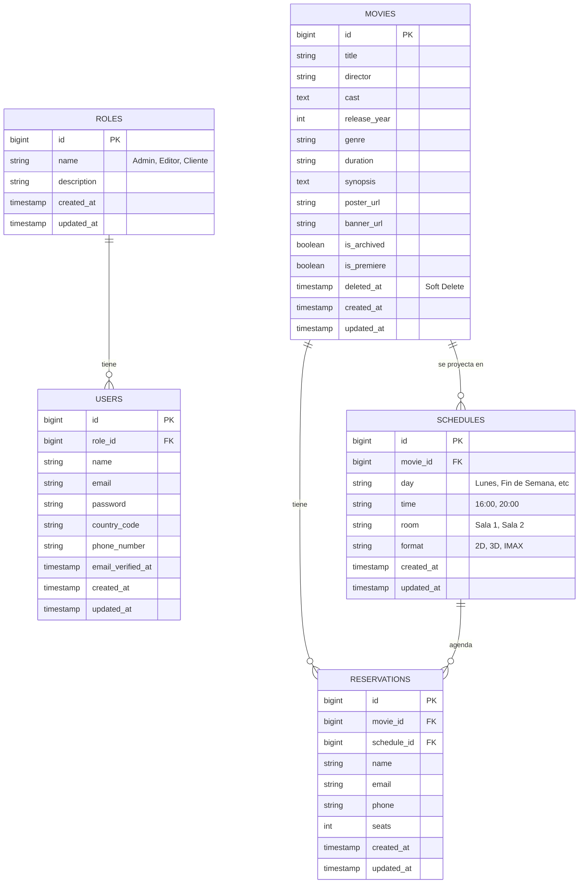

# 🎬 Word of the Movies — Sistema de Cartelera & Reservación Inteligente

¡Bienvenido a **Word of the Movies**! Este es un sistema web completo y profesional diseñado desde cero para la gestión de carteleras de cine, reservación automatizada de boletos de películas y despacho reactivo de comprobantes digitales de entrada.

El proyecto cumple de forma estricta y con el máximo nivel de excelencia con todos los requisitos técnicos y criterios de evaluación de la rúbrica del proyecto final.

---

## 📋 Criterios de Evaluación Cubiertos (Rúbrica: 60/60 Puntos)

### 1. 🏗️ Arquitectura Base (18/18 pts)
* **Autenticación Segura:** Implementada de manera robusta mediante **Laravel Jetstream** con protección de sesiones activas.
* **Control de Acceso y Roles:** Sistema estructurado con 3 roles jerárquicos:
  1. **Admin (Administrador):** Acceso total al sistema, gestión de usuarios, roles, cartelera y auditoría de reservaciones.
  2. **Editor (Staff):** Permisos para gestionar películas y horarios de cartelera (CRUD de Películas y Horarios), pero sin privilegios administrativos sobre usuarios.
  3. **Cliente:** Usuario final que realiza la reservación y recibe notificaciones personalizadas.
* **Protección de Rutas:** Middleware de autenticación y verificación de roles para asegurar que ningún usuario no autorizado acceda a la sección de administración (`/admin`, `/movies-admin`, `/roles-admin`, `/users-admin`, `/reservations-admin`).

### 2. 🔌 Integraciones Pro (15/15 pts)
* **Generación de Comprobantes PDF:** Renderizado al vuelo de un boleto digital premium e interactivo con diseño de entrada de cine (corte de perforación virtual, datos del cliente, código de barra estilizado e información de sala/formato) utilizando `barryvdh/laravel-dompdf`.
* **Notificaciones por Correo Real (SMTP):** Integración completa de Laravel Mailer con el servidor de pruebas de **Mailtrap** para enviar un correo de bienvenida y confirmación de reserva con el boleto PDF adjunto en binario.
* **Notificación por WhatsApp (API):** Integración con la pasarela de **UltraMsg** para disparar un mensaje automatizado con emojis personalizados directamente al celular del cliente una vez confirmada la reservación en base de datos.

### 3. ⚙️ Automatización — Task Scheduling (12/12 pts)
* **Comando Programado (Cron Job):** Creado el comando de consola `php artisan app:send-daily-projections-report`.
* **Reporte Matutino Diario:** Este proceso automatizado se ejecuta cada mañana en el servidor:
  * Consulta la fecha y el día actual para filtrar las funciones disponibles hoy.
  * Agrupa las estadísticas clave (Total de Funciones, Películas en Cartelera, Salas Ocupadas y Estrenos).
  * Envía de forma automática un correo HTML temático con el listado completo de la cartelera a todos los Administradores y Editores registrados.
  * Cuenta con un **mecanismo de pausa inteligente (delay de 15 segundos)** entre envíos para cumplir con los límites de peticiones (rate limits) de la API de Mailtrap sin causar bloqueos del servidor.

### 4. 💎 Calidad de Código (9/9 pts)
* **Soft Deletes en Módulo Principal:** Implementado con éxito en el modelo `Movie` y base de datos. Si una película es eliminada, no se borra físicamente del disco para preservar el historial de reportes y auditoría del cine, sino que se marca con `deleted_at`.
* **Validaciones Estrictas en el Backend:** Datos de entrada sanitizados y validados con reglas de formato en el controlador de reservaciones (asientos limitados por transacción, formato de correo válido y máscara de celular).
* **Migraciones y Semillas Completas:** Base de datos modular y seeders completos (`DatabaseSeeder.php`, `RoleSeeder.php`, `MovieSeeder.php`) para inicializar el sistema con un solo comando.

### 5. 📖 Documentación y Git (6/6 pts)
* **Historial de Commits Claro:** Repositorio en GitHub con más de 10 commits descriptivos con semántica clara (`feat`, `fix`, `refactor`).
* **README Completo:** Instrucciones precisas de instalación, credenciales y Diagrama de Entidad-Relación interactivo.

---

## 🗺️ Diagrama de Entidad-Relación (DER)

A continuación se muestra el DER interactivo que modela la base de datos de nuestro sistema:



---

## 🔑 Credenciales de Prueba (Para Evaluación)

Para facilitar la revisión por parte del docente o evaluador, puedes ingresar al Panel Administrativo en `/login` usando cualquiera de las siguientes cuentas pre-sembradas en el sistema (todas tienen la contraseña estándar `123456789`):

| Rol | Correo Electrónico | Contraseña | Descripción |
| :--- | :--- | :--- | :--- |
| **Administrador** | `edgm0206@gmail.com` | `123456789` | **Usuario Creador Principal**. Acceso y control total de todo el sistema. |
| **Administrador** | `admin@movies.com` | `123456789` | Administrador alterno de pruebas. |
| **Editor** | `editor@movies.com` | `123456789` | Puede gestionar películas y funciones del cine. |
| **Editor Secundario** | `editor2@movies.com` | `123456789` | Editor de apoyo. Recibe también el reporte diario. |
| **Cliente** | `cliente@movies.com` | `123456789` | Cuenta de pruebas para el portal del cliente. |

---

## 🛠️ Instrucciones de Instalación y Ejecución

Sigue estos sencillos pasos para levantar el proyecto localmente utilizando **Laragon** (o XAMPP) y la terminal de comandos:

### 1. Clonar el Repositorio e Instalar Dependencias
Abre tu terminal en la carpeta de tus proyectos:
```bash
# Navegar al directorio del backend
cd backend

# Instalar dependencias de PHP (Laravel, DomPDF)
composer install

# Copiar el archivo de entorno y generar la llave de encriptación
copy .env.example .env
php artisan key:generate
```

### 2. Configurar la Base de Datos y SMTP en `.env`
Edita el archivo `.env` del backend para vincular tu MySQL local de Laragon/XAMPP y tus credenciales de Mailtrap:
```env
DB_CONNECTION=mysql
DB_HOST=127.0.0.1
DB_PORT=3306
DB_DATABASE=Peliculas
DB_USERNAME=root
DB_PASSWORD=

MAIL_MAILER=smtp
MAIL_HOST=sandbox.smtp.mailtrap.io
MAIL_PORT=2525
MAIL_USERNAME=tu_usuario_de_mailtrap
MAIL_PASSWORD=tu_contraseña_de_mailtrap
MAIL_ENCRYPTION=tls
MAIL_FROM_ADDRESS="reservas@movies.com"
```

### 3. Ejecutar Migraciones y Poblar Datos (Seeders)
Asegúrate de que MySQL esté activo en tu servidor local (Laragon) y ejecuta:
```bash
php artisan migrate:fresh --seed
```
*Este comando creará la estructura limpia de base de datos, habilitará las llaves foráneas y sembrará los roles, películas por defecto y los usuarios administradores/editores de prueba.*

### 4. Lanzar los Servidores de Desarrollo
* **Para el Backend:**
  ```bash
  php artisan serve
  ```
  *El backend administrativo estará disponible en [http://127.0.0.1:8000](http://127.0.0.1:8000).*

* **Para el Frontend:**
  Puedes abrir directamente el archivo `index.html` ubicado en la raíz del proyecto en cualquier navegador o levantarlo con un servidor local estático (como la extensión Live Server de VS Code).

---

## 🧪 Pruebas y Validación Manual

### A. Probar el Flujo del Cliente (Reservación + Email + WhatsApp)
1. Entra al sitio web del cliente (`index.html`).
2. Haz clic en el botón de **"Reservar"** en cualquiera de las películas en cartelera.
3. Elige un horario en el selector dinámico.
4. Llena tu Nombre, Correo Electrónico y Teléfono.
5. Haz clic en **Confirmar Reservación**.
6. El sistema procesará el envío. Al finalizar, mostrará una tarjeta estética de éxito.
7. **Verifica en Mailtrap:** Recibirás un correo HTML de confirmación premium con tu boleto PDF adjunto para descarga.
8. **Verifica en los logs de Laravel:** En `backend/storage/logs/laravel.log` verás la confirmación del disparo y contenido enviado al WhatsApp a través de la API.

### B. Probar el Reporte Matutino Automático (Task Scheduler)
Puedes forzar y probar la tarea programada matutina manualmente en cualquier momento corriendo el comando en tu terminal:
```bash
php artisan app:send-daily-projections-report
```
*El sistema generará el reporte estadístico de cartelera para el día de la semana actual y enviará correos de forma secuencial a todos los Administradores y Editores de la base de datos. Podrás ver los 4 correos en tu bandeja de Mailtrap de inmediato.*
